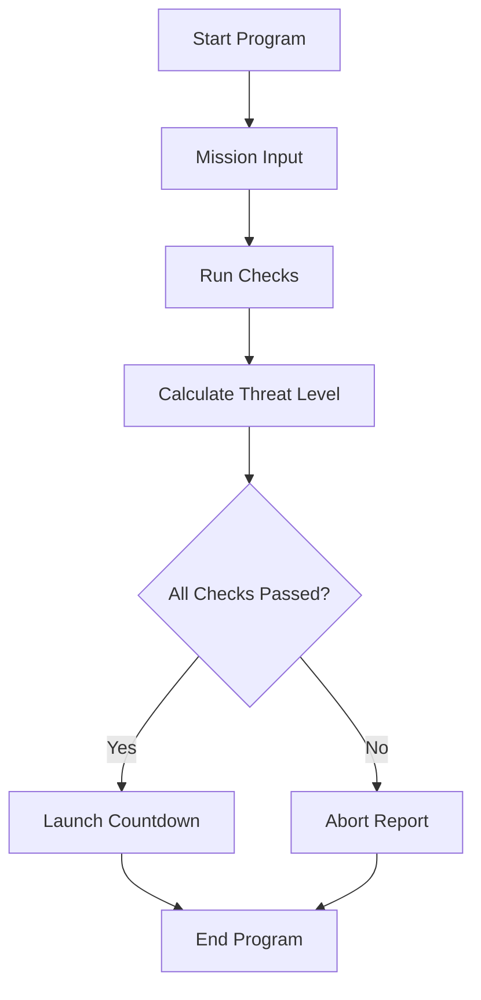

# Architecture

## Project Overview

`liftoff-protocol` is a simple C++ command-line application that simulates a spacecraft launch checklist. Built as a beginner project, it provides an interactive terminal experience where the user enters mission details and telemetry data, and the program runs validation checks to decide whether to launch or abort.

This project was created to practice foundational C++ programming concepts:
- Primitive data types (`int`, `double`, `char`, `bool`) and `std::string`
- Standard input and output (`std::cin`, `std::cout`)
- Conditional logic (`if / else if / else`) and logical operators (`&&`, `!`)
- Loops (`for` countdowns) and increment operators (`threatLevel++`)
- Basic delays using `<thread>` and `<chrono>`

---

## Program Flow

The diagram below outlines how data moves through the application from user input to the final launch or abort output:



---

## Inputs

The program collects nine user inputs from the console using `std::cin`:

- **Mission Name** (`std::string`): Single-word codename for the mission.
- **Commander Initial** (`char`): Single character initial.
- **Crew Count** (`int`): Number of astronauts on board.
- **Fuel Level** (`double`): Percentage of fuel remaining.
- **Oxygen Level** (`double`): Percentage of oxygen remaining.
- **Engine Temperature** (`double`): Temperature in degrees Celsius.
- **Navigation Status** (`bool` / `int`): System status (1 for online, 0 for offline).
- **Communication Status** (`bool` / `int`): System status (1 for online, 0 for offline).
- **Authorization Code** (`int`): Passcode for launch clearance.

---

## Validation Rules

The program tests each input against predefined safety criteria and sets boolean flags for each check:

| Parameter | Type | Required Condition | Variable Flag |
| :--- | :--- | :--- | :--- |
| Crew Count | `int` | Between `2` and `6` | `crewOkay` |
| Fuel Level | `double` | At least `85.0%` | `fuelOkay` |
| Oxygen Level | `double` | At least `90.0%` | `oxygenOkay` |
| Engine Temp | `double` | Between `40.0°C` and `90.0°C` | `engineOkay` |
| Navigation | `bool` | Must be `true` (`1`) | `navigationOkay` |
| Communication | `bool` | Must be `true` (`1`) | `communicationOkay` |
| Auth Code | `int` | Must equal `7392` | `authorizationOkay` |

---

## Threat Level

The `threatLevel` is a simple integer counter starting at `0`. It tracks how many critical systems are offline or invalid:

```cpp
int threatLevel = 0;

if (!navigationOnline)
    threatLevel++;

if (!communicationOnline)
    threatLevel++;

if (authorizationCode != 7392)
    threatLevel++;
```

The final `threatLevel` value determines the security status text (`SECURE`, `CAUTION`, `HIGH RISK`, or `CRITICAL`).

---

## Countdown and Timing

The program uses `<thread>` and `<chrono>` to pause execution and simulate real-time terminal activity:
- **Diagnostic pauses**: `std::this_thread::sleep_for(std::chrono::milliseconds(700))` between check outputs.
- **Countdown loop**: A `for` loop counting down from 10 to 1 with 1-second delays (`std::chrono::seconds(1)`).
- **Audio beep**: Uses `\a` (ASCII alert bell) during countdown ticks.

---

## Current Structure

Currently, all code lives inside a single `main()` function in `main.cpp`. This is an intentional choice for a beginner project, keeping all variables and control flow in one easy-to-read sequential file.

The program execution is broken into sequential steps:
1. Print ASCII banner and collect inputs.
2. Run validation checks with delayed console output.
3. Compute threat level score.
4. Evaluate combined boolean check (`crewOkay && fuelOkay && ...`).
5. Execute the countdown loop (if passed) or print the abort summary (if failed).

---

## Limitations

- **No input recovery**: If a user enters letters when numbers are expected, `std::cin` enters a failure state and skips remaining prompts.
- **Single-word strings**: `std::cin >> missionName` stops at spaces (e.g. entering "Apollo 11" reads only "Apollo").
- **Hardcoded values**: Safety limits and the passcode `7392` are written directly into conditional checks.

---

## Possible Improvements

As programming skills progress, the code can be improved with:
- **Functions**: Split input collection, checks, and countdown into separate functions.
- **Input Validation**: Use `std::cin.fail()` and `std::cin.ignore()` to handle invalid user input cleanly.
- **Full Line Reading**: Use `std::getline(std::cin, missionName)` to allow spaces in mission names.
- **Named Constants**: Store thresholds in `const` or `constexpr` variables instead of hardcoded numbers.
- **Sound Effects**: Replace console bell `\a` with real audio cues or enhanced terminal feedback.
